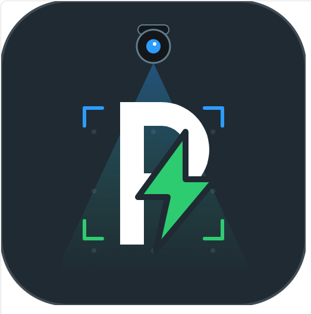

<p align="center">
  
</p>

<h1 align="center">EV Parking System</h1>

<p align="center">
  CCTV 기반 스마트 주차장 통합 관제 시스템 설계 및 구현 · 2026 졸업작품
</p>

<p align="center">
  
  
  
</p>

---

## 프로젝트 소개

한화비전(Hanwha Vision) CCTV와 STM32 센서 노드를 결합해, 주차면 점유·전기차(EV) 여부·화재를
실시간으로 감지하고 관제 요원이 Qt 클라이언트 하나로 확인·대응할 수 있게 하는 통합 주차 관제
시스템입니다.

- **감지** — STM32 홀 센서(점유)와 불꽃 센서(화재)가 LoRa로 Raspberry Pi 게이트웨이에 보고
- **인식** — Pi 서버가 카메라 Snapshot/RTSP 프레임을 OpenCV로 전처리하고 Gemini OCR로 번호판을
  판독해 EV / NON_EV / UNKNOWN을 판별, SQLite에 세션·이미지·이벤트로 기록
- **관제** — Qt 클라이언트가 4채널 RTSP 영상과 주차면 상태(점유 시간, 차량번호, 위반 여부)를
  표시하고, MQTT로 화재 후보 알림을 받아 즉시 경고

```text
STM32 (홀/불꽃 센서) → LoRa → Raspberry Pi 서버 (MQTT·Snapshot API·OpenCV·Gemini OCR·SQLite)
                                        ↓
                              Qt 관제 클라이언트 (RTSP 영상·주차 상태·화재 알림)
```

VEDA 4th Team5 프로젝트의 4개 하위 시스템(`Pi_Server`, `Qt_Client`, `STM`, `cv_snapshot_api`)을
하나의 저장소로 통합했습니다. 각 폴더는 원래 개별 저장소였으며, 현재는 이 저장소의 하위
디렉터리로 관리됩니다.

## 구성

- [`Pi_Server`](./Pi_Server) — Raspberry Pi 기반 C++ 서버 (MQTT, RTSP, Snapshot API, OpenCV, SQLite)
- [`Qt_Client`](./Qt_Client) — Qt/C++ 관제 클라이언트
- [`STM`](./STM) — STM32 펌웨어 (LED/Buzzer/지자기센서 연동)
- [`cv_snapshot_api`](./cv_snapshot_api) — OpenCV 기반 Snapshot/영상 처리 API

각 하위 폴더의 상세 내용은 폴더 내 README.md를 참고하세요.

## v1.0 릴리즈 노트

> 원본 저장소(`Pi_Server`, `Qt_Client`, `STM`)의 [v1.0 릴리즈](https://github.com/VEDA-4th-Team5/Pi_Server/releases/tag/v1.0)에 작성된 내용입니다.

# v1.0 — 프로토타입 배포

STM32 센서 → Raspberry Pi → 카메라/MQTT/DB로 이어지는 주차 감시·화재 감지
파이프라인의 첫 통합 프로토타입입니다.

### 🅿️ 홀센서 기반 주차 세션 관리
- STM32 UART 신호 → 세션 생성/종료 상태머신 연결 (EVDA-134)
- 점유 확인 게이트(재정렬 flap 필터) + 촬영 스케줄러 초안 (EVDA-135)
- 촬영 스케줄러 Pi 서버 통합 및 빌드 검증 (EVDA-144)
- 주차 시작/장기 점유 증거 이미지 촬영 + 세션 이미지 조회 API 연동 (EVDA-146)
- BestShot 차량 감지가 홀센서보다 먼저 세션을 만든 경우에도
  증거촬영/OCR이 정상 예약되도록 수정 (#24)

### 🔥 화재 감지 (STM32 ↔ Pi ↔ Qt)
- STM32 UART 화재 신호 수신 및 MQTT 발행 (EVDA-125)
- 센서 통신 계층 재설계: UART/LoRa 공용 전송 계층, 재연결·에러 이벤트 로깅 (EVDA-91)
- Qt-서버 간 화재 알람 MQTT 프로토콜 충돌 수정 (EVDA-159)
- 화재 알람 ACK 및 OPEN/ACKNOWLEDGED/RESOLVED 상태 전이 구현 (EVDA-170)

### 🔌 디바이스 연동
- `/dev/parking_alert` Linux Character Device 드라이버 (32면 알림 비트, ioctl/poll) (EVDA-90)

### 🗄️ 데이터/타이머 기반
- 주차 세션 DB 스키마 통합, 슬롯 ID/SQL 경로 정리 (EVDA-129)
- 장기 점유 타이머 기능 (EVDA-88)

### 🐛 v1.0 안정화
- 로그 스팸 억제(EXIT_IGNORED/HALL_SENSOR 태그별 필터링),
  중복 세션 생성 경합 조건 수정 (EVDA-167)

전체 변경: `git log main..develop` (23 커밋)

### 스크린샷


## cv_snapshot_api 릴리즈 노트

> 원본 저장소(`cv_snapshot_api`)에는 별도 GitHub Release가 없고, 대신 저장소 내
> [`RELEASE_NOTES.md`](./cv_snapshot_api/RELEASE_NOTES.md)에 버전별 구현/검증 상태가 기록되어
> 있습니다. 그 내용을 그대로 옮겼습니다.

이 문서는 실제 구현과 검증 상태를 구분해 기록한다. 출시 버전에는 확인되지 않은 기능이나 외부 구성요소 연동을 포함하지 않는다.

### [refector] - 2026-08-24

`cv_snapshot_api_release`의 별도 소스 복사본이다. ROI와 입력 해상도는 바꾸지 않았다.

- OpenCV 내부 병렬 처리를 기본 1개 스레드로 제한한다.
- 무거운 Canny·환경 분석·이미지 세트 처리를 하나의 admission slot으로 직렬화하고, 기본
  2,500 ms 시작 간격을 둔다. 너무 이른 요청은 HTTP 429
  `PROCESSING_RATE_LIMITED`, 진행 중 요청은 HTTP 503 `PROCESSING_BUSY`를 반환한다.
- `GET /image/jpg`는 채널별 최근 처리 JPEG를 기본 2,500 ms 동안 반환한다. rate limit 또는
  busy 상태인데 이전 결과가 있으면 그 stale 결과를 반환해 polling이 새 캡처를 증폭시키지 않는다.
- 새 값은 `SampleComponent_default_attribute_0.json`의 `opencv_thread_limit`,
  `processing_min_interval_ms`, `processed_jpeg_cache_ttl_ms`로 조정한다.

CV5 Docker build, 새 CAP 생성, 카메라 runtime CPU·온도·watchdog 검증은 아직 수행하지 않았다.

### [0.1.0] - 2026-08-05

#### 기준선

CV5 OpenSDK용 현재 `cv_snapshot_api` 소스와 테스트 UI의 기능 기준선이다. 이 버전은 카메라 프레임을 캡처하고, 동일 프레임의 원본·자동 개선·지정 필터 JPEG를 제공한다.

#### 주요 기능

- SDK channel `0`부터 `3`까지 선택 가능한 채널 조회와 진단 흐름
- JPEG 조회 서버 시작 및 기존 `GET /image/jpg?channel={channel}` 호환 경로
- 동일 프레임 기준 원본, 자동 개선, 지정 OpenCV 필터 결과 생성
- 영상 기반 환경 판단과 자동 필터 선택
- `run_id`와 결과 ID 기반 JPEG 조회
- 활성 필터 catalog 조회 및 다중 필터 비교용 테스트 웹 UI
- 파일 로그 조회·삭제와 4채널 순차 진단 UI

#### 운영 API

| Method | Endpoint | 역할 |
|---|---|---|
| POST | `/opensdk/{app_id}/startserver` | JPEG 조회 TCP HTTP 서버 시작 |
| GET | `/opensdk/{app_id}/channels` | 지원 채널과 기본 채널 조회 |
| GET | `/opensdk/{app_id}/filters` | 직접 요청 가능한 처리 필터 조회 |
| POST | `/opensdk/{app_id}/images/generate` | 한 프레임의 원본·개선·지정 필터 결과 생성 |
| GET | `http://{camera-ip}:{port}/images/result/jpg?run_id={run_id}&result={id}` | 생성 JPEG 조회 |

상세 요청·응답과 오류 계약은 [`cv_snapshot_api/docs/server-api-integration.md`](./cv_snapshot_api/docs/server-api-integration.md)를 따른다.

#### 제공 필터

| 필터 ID | 대응 환경 |
|---|---|
| `bilateral_d5` | `sensor_noise` |
| `stretch_1_99` | `low_contrast` |
| `fast_bilateral` | `extreme_low_light` |
| `bilateral_gamma_clahe` | `ir_night` |
| `backlight_combined` | `backlight` |

#### 알려진 제한사항

- 환경 판단은 입력 JPEG의 영상 특징 기반 추정이며, Day/Night 모드, IR LED 상태, IR-cut filter 상태와 센서 흑백 모드는 조회하지 못한다.
- 동시에 하나의 이미지 생성 요청만 처리하며, 겹친 요청은 `PROCESSING_BUSY`가 될 수 있다.
- 결과 JPEG는 최근 8개 `run_id`만 메모리에 보관한다. 앱 재시작 시 삭제되며 영구 저장되지 않는다.
- `auto_filter` 또는 `applied_filter`가 `none`이면 검증된 개선 처리를 적용하지 않은 원본 내용 JPEG를 뜻한다.
- 인증, HTTPS, 외부 접근 제한과 장기 로그 보존은 범위에 포함되지 않는다.

#### 검증 상태

| 항목 | 상태 | 근거 및 경계 |
|---|---|---|
| 운영 API route·요청·응답 계약 | 정적 확인 | 현재 C++ source와 서버 연동 문서 대조 |
| OpenCV/필터 catalog·이미지 결과 cache | 정적 확인 | source 기준, 최신 CAP 재검증 필요 |
| 테스트 웹 UI·로그 UI | 정적 확인 | source 기준, 최신 CAP 설치 후 재확인 필요 |
| 과거 묶음 CAP의 이미지·로그 기본 흐름 | 카메라 확인 기록 있음 | 이후 이미지 세트·UI 변경분을 포함한 최신 CAP 증거는 별도 필요 |
| 현재 source의 CV5 Docker 빌드 | 미검증 | 이 기준선에 대해 새 build 필요 |
| 현재 source의 CAP 생성·설치 | 미검증 | 이 기준선에 대해 새 CAP 필요 |
| 현재 source의 카메라 4채널·이미지 세트 런타임 | 미검증 | 최신 CAP 설치 후 확인 필요 |
| 서버 OCR·STM LED 연동 | 미구현 | `0.2.0` 이후 범위 |

#### 호환성

- 위 운영 API의 기존 method와 path를 유지한다.
- `run_id`는 카메라가 생성하며, 서버가 미리 생성하거나 추측하지 않는다.
- 레퍼런스 프로젝트 `snapshot_jpeg`, `display_image_opencv`는 변경하지 않았다.

### 다음 버전

`0.2.0`은 저조도 OCR 재촬영 지원을 위한 카메라 메타데이터 확장과 서버·STM 연동 검증을 대상으로 한다. 아직 구현 또는 릴리즈 항목으로 확정하지 않는다. 세부 계획은 [`cv_snapshot_api/docs/implementation-plan.adoc`](./cv_snapshot_api/docs/implementation-plan.adoc)에 기록한다.
